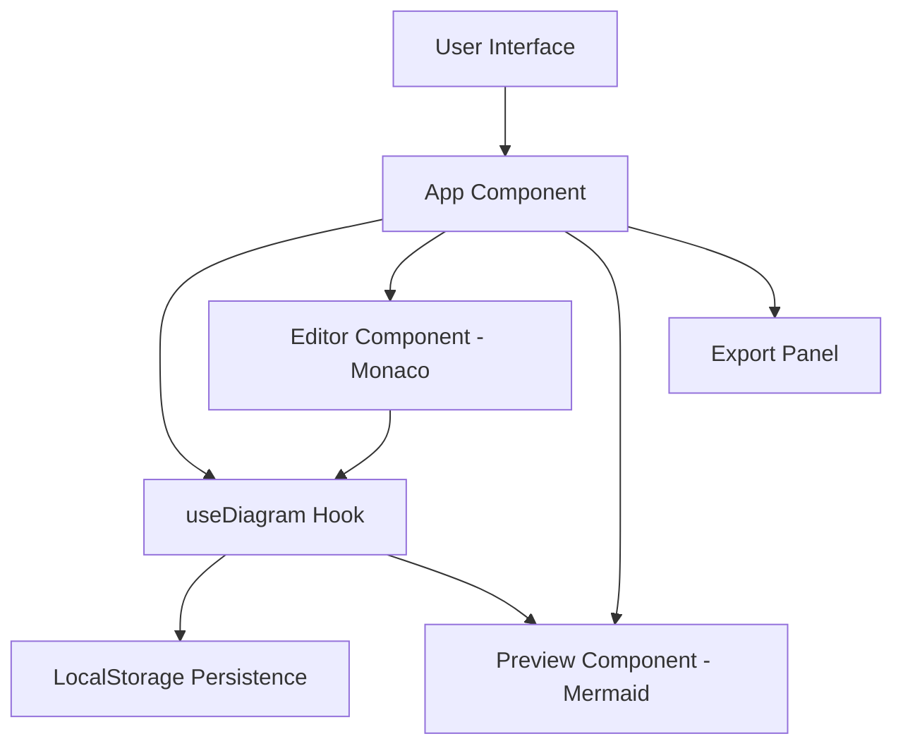
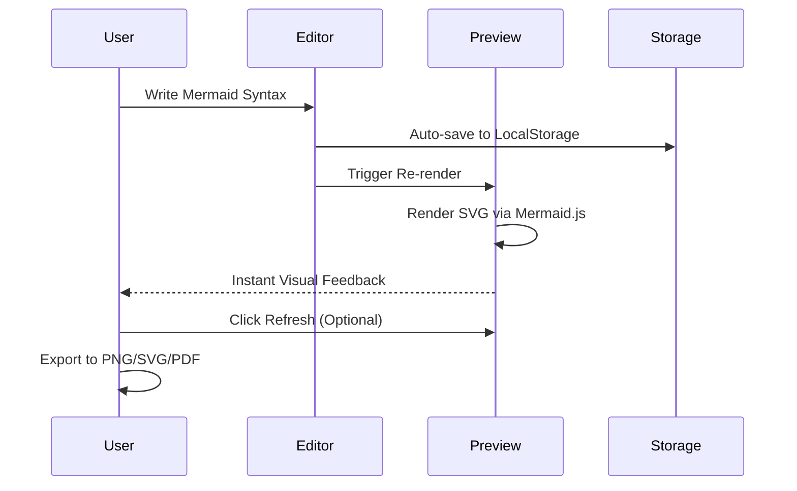

# Diagram Studio

Professional Mermaid diagram editor built with React, Vite, and Monaco Editor. Diagram Studio provides a high-performance workspace for creating flowcharts, sequence diagrams, and more with real-time preview and multi-format exports.

## Features

- Real-time Mermaid rendering.
- Integrated Monaco Editor with syntax highlighting.
- Global Light and Dark mode support.
- Diagram theme selection (Forest, Neutral, Dark, etc.).
- High-resolution exports (PNG, SVG, PDF).
- Persistence of diagrams and preferences.

## Architecture

The following diagram illustrates the high-level architecture of the application:



## User Flow

The typical workflow for creating a diagram in Diagram Studio is as follows:



## Getting Started

### Prerequisites

- Node.js (v18 or higher)
- npm or pnpm

### Installation

1. Clone the repository:
   ```bash
   git clone <repository-url>
   ```

2. Install dependencies:
   ```bash
   npm install
   ```

3. Start the development server:
   ```bash
   npm run dev
   ```

## Development

The project uses Tailwind CSS for styling and Lucide React for iconography. For Mermaid rendering, the application utilizes the official mermaid.js library.

### Key Directories

- `src/components`: React components for UI elements.
- `src/hooks`: Custom hooks for state management and persistence.
- `src/styles`: Global CSS and Tailwind configurations.

## License

This project is licensed under the MIT License.
